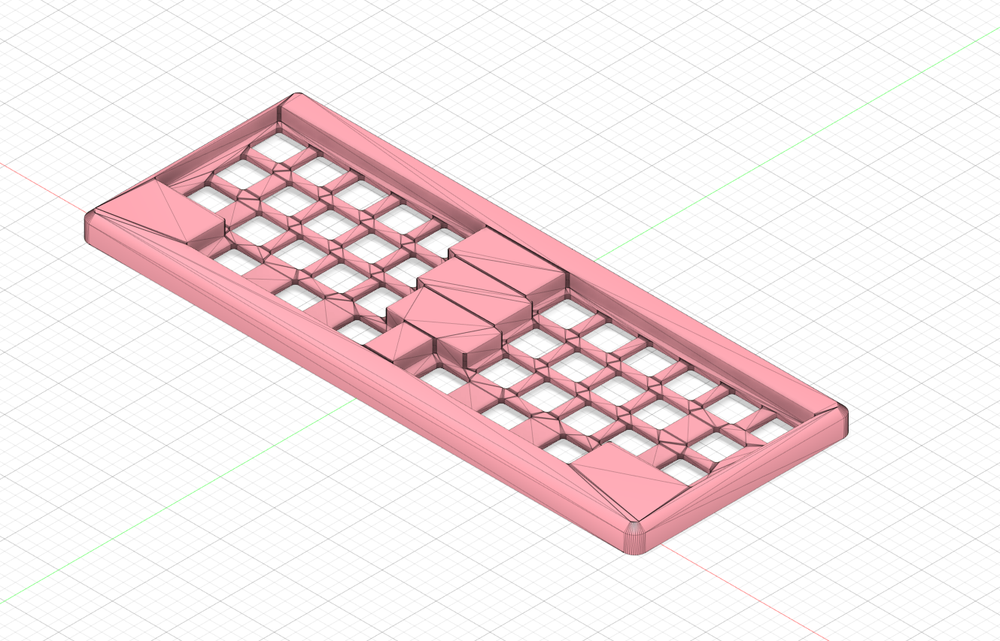
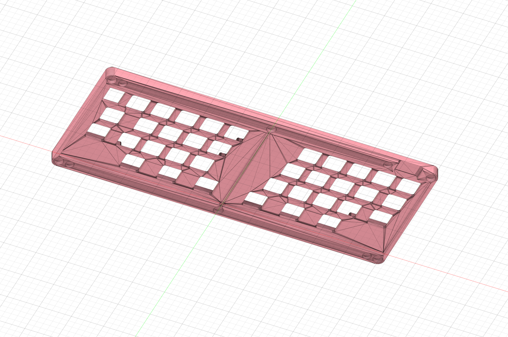
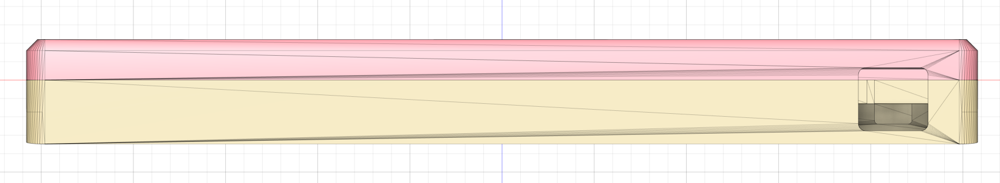
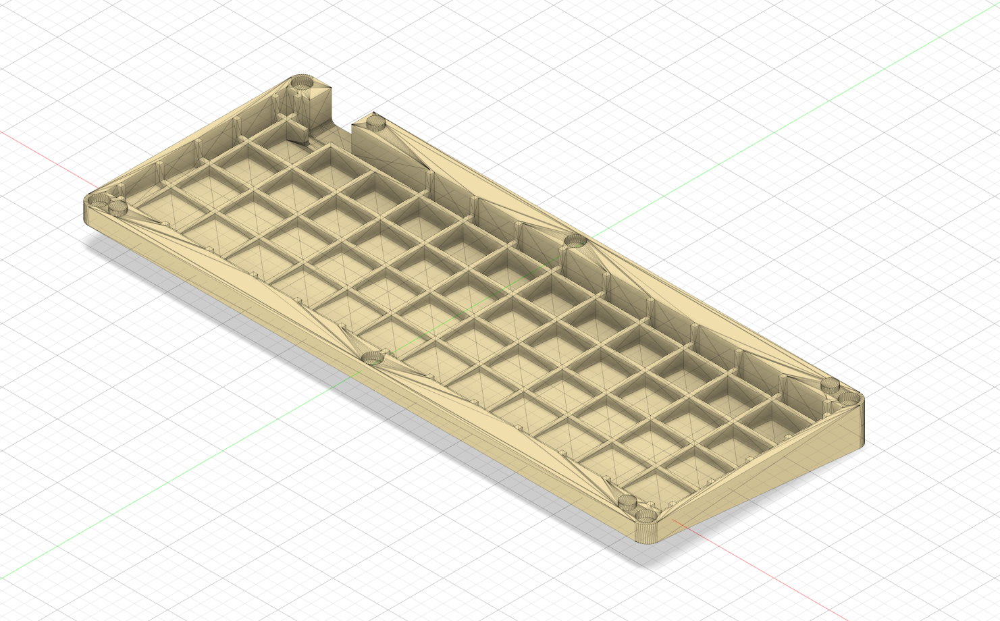
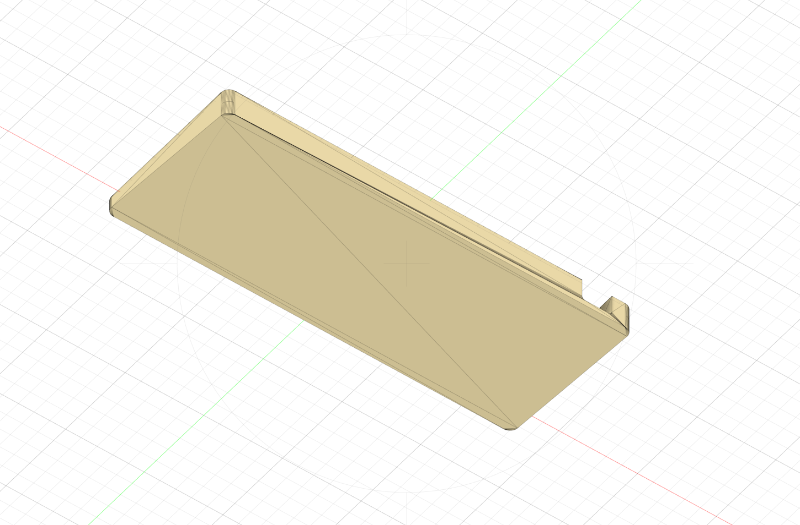

## ポイント
- 上下で分割された2ピース構成
- トップケースはスイッチプレートの役割も兼ねており、好きなキースイッチやキーキャップをセッティングしたまま脱着可能
  - キースイッチ穴のクリアランスは1.5mmに設定
    - プリントの出力形式によっては1mm誤差が発生する可能性があるため0.1mm増やしている。穴が大きくグラつく場合はテープなどでサポートする
- 上下のかみ合わせについて
  - 凹凸 + マグネット穴を設けている
    - 凹凸のみでも充分な場合が多い
    - マグネットを使うことでより密着する
    - マグネットを使用する場合は6mm×3mmのもの推奨(上下6個ずつ計12個必要)

## アウトライン

- トップケース中央にサッシ有
  - クリアレジンだと格好が悪くなるため、次回改善予定
 

